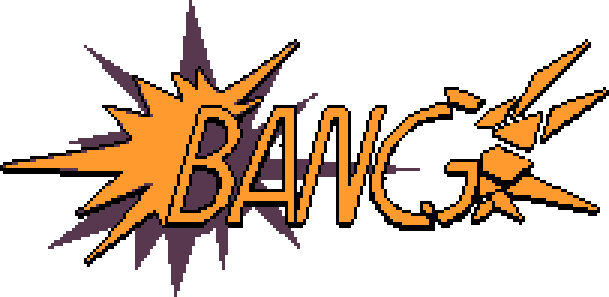

<p align="center">

</p>

<h1 align="center">A real ECS framework!</h1>

<p align="center">
<a href="https://github.com/isadorasophia/bang/actions/workflows/tag_release.yaml"></a>
<a href="LICENSE"></a>
</p>

<p align="center">
Welcome to Bang! - an Entity Component System framework in C#.
</p>

### How does it work?
This is not, in any way, an engine, but rather a framework that you can use in whatever engine you're comfortable with. This is currently integrated with [Murder engine](https://github.com/isadorasophia/murder).

Check out our [wiki](https://github.com/isadorasophia/bang/wiki) for more details.

### How to use it?
We are on nuget! So you can either use this repository as a submodule or simply add:

```csproj
<!-- Main Package. -->
<PackageReference Include="Murder.Bang" Version="0.0.2-alpha" />

<!-- Generator package. Mandatory, include it so Bang can generate lookup classes and extensions for your Components. -->
<PackageReference Include="Murder.Bang.Generator" Version="0.0.4">
    <PrivateAssets>all</PrivateAssets>
    <IncludeAssets>runtime; build; native; contentfiles; analyzers; buildtransitive</IncludeAssets>
</PackageReference>

<!-- Optional Package with analyzers and code fixes. -->
<PackageReference Include="Murder.Bang.Analyzers" Version="0.0.3">
    <PrivateAssets>all</PrivateAssets>
    <IncludeAssets>runtime; build; native; contentfiles; analyzers; buildtransitive</IncludeAssets>
</PackageReference>
```

Whatever makes you happier. The nuget package should have symbols and source embedded available with Source Link.

### Real-life examples
[Neo City Express](https://github.com/isadorasophia/neocityexpress) was a Ludum Dare game (made in 72h ⏰) built on top of **Murder** and **Bang**. I highly recommend checking it out, especially if you're good with learning from examples.
